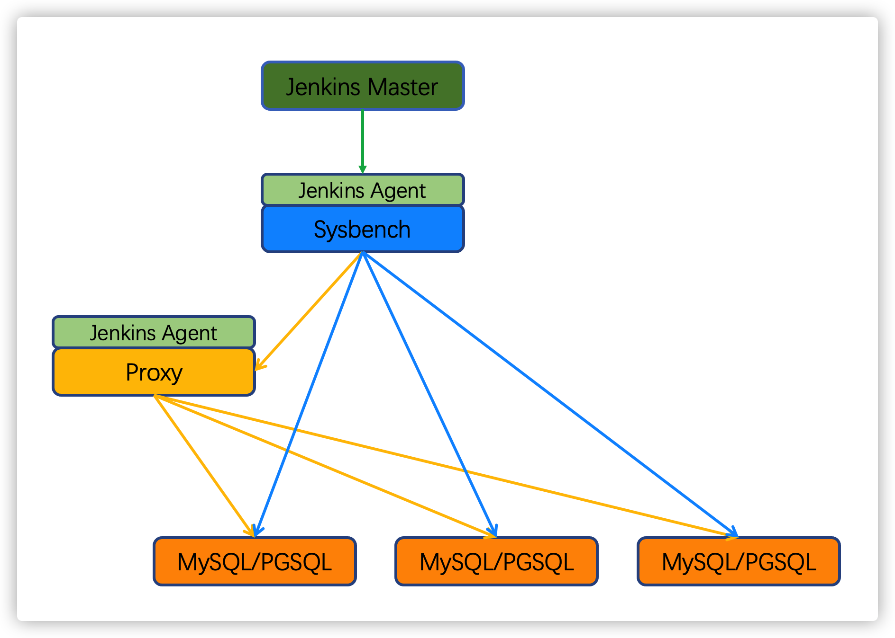
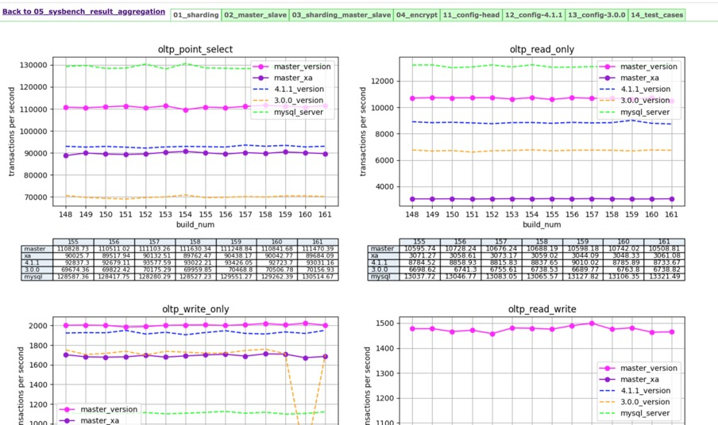
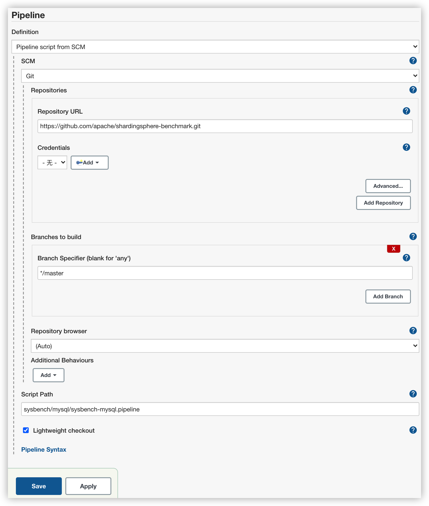

## SharingSphere sysbench pressure test toolbox


### Sysbench Introduction

sysbench is an opensource scriptable multi-threaded benchmark tool based on LuaJIT. Usually benchmark for CPU, Memory, I/O and so on. The contained script could benchmark the performance for OLTP like database.

SharingSphere invoke Sysbench as the part of performance test, mainly for MySQL, PGSQL and Proxy, and then compare the performance of proxy and other database.  

### Sysbench Test Environment

The performance test is triggered by jenkins schedule task, base on the hardware like following:

| Host     | CPU     | Memory | IP |
| ------   | ------  | ---  | --- |
| Jenkins  | 4 core  | 8G   | 10.0.100.10 |
| Sysbench | 8 core  | 16G  | 10.0.100.20 |
| Proxy    | 32 core | 32G | 10.0.100.30 |
| MySQL or PGSQL | 32 core | 32G  | 10.0.100.40 |
| MySQL or PGSQL | 32 core | 32G  | 10.0.100.41 |

Network is 10Gb Ethernet



for example there are 5 machines, the ip and hardware like upon picture

Install jenkins on `10.0.100.10`, and config 2 nodes.

Install sysbench on `10.0.100.20`, and launch up the agent on `10.0.100.20`，`10.0.100.30`, the agent could download from jenkins

### Jenkins Pipeline

Sysbench doesn't rely on any CI/CD tool, even it could be executed in console manully. The reason of choosing jenkin to manage sysbench, is that jenkins could make the pressure test process automatically and transparently.

Following is the test process of Jenkin management

  1. Install Proxy
  2. Prepare Sysbench
  3. Prepare Proxy
  4. Test Proxy

#### Install Proxy

In this stage, jenkins will create the directories and nessasery files for proxy through jenkins agent. And then clone ShardingSphere Code by git, compile the code, unzip the proxy districution.

#### Prepare Sysbench

In this stage, jenkins will create the directories and nessasery files for sysbench, makes the parameters and sysbench script ready.

#### Prepar Proxy
 
In this stage, jenkins will prepare the config files or driver(e.g. MySQL Driver) for proxy, and start up proxy

#### Test Proxy

In this stage, jenkins will make pressure test to proxy by the parameters in config files. after test, a python script will generate an image by sysbench result, could check the difference of different test in jenkins report.

### sysbench report

sysbench will generate result as a .txt file, the content like following: 

```
SQL statistics:
    queries performed:
        read:                            28147663
        write:                           0
        other:                           0
        total:                           28147663
    transactions:                        28147663 (156336.98 per sec.)
    queries:                             28147663 (156336.98 per sec.)
    ignored errors:                      0      (0.00 per sec.)
    reconnects:                          0      (0.00 per sec.)

General statistics:
    total time:                          180.0437s
    total number of events:              28147663

Latency (ms):
         min:                                    0.59
         avg:                                    2.46
         max:                                  281.08
         99th percentile:                        5.28
         sum:                             69103716.45

Threads fairness:
    events (avg/stddev):           73301.2057/786.12
    execution time (avg/stddev):   179.9576/0.01
```

the python script in this projet will generate analysis image as following:



### How to do the same test through Jenkin by yourself

fork current prject, and then create Jenkins pipeline, `Pipeline` choose `pipeline script from SCM`. the address of SCM is this project git address `https://github.com/apache/shardingsphere-benchmark.git`

test different senario by setting different script path:

test mysql : sysbench/mysql/sysbench-mysql.pipeline
test pgsql : sysbench/mysql/sysbench-pgsql.pipeline
test proxy + mysql : sysbench/proxy-mysql/sysbench-proxy-mysql.pipeline
test proxy + pgsqsl : sysbench/proxy-pgsql/sysbench-proxy-pgsql.pipeline

Modify the conf in `.env` and the yaml files in `prepared-conf` to suit your environment
>  if test mysql, need to put MySQL driver(e.g. mysql-connector-java-8.0.24.jar) in `prepared-conf` which in the script path


as following:

